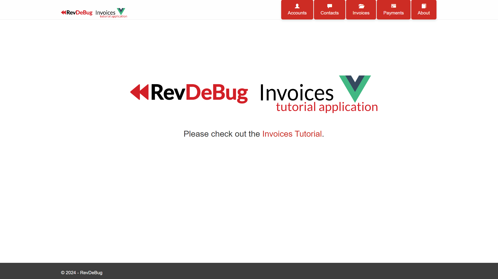
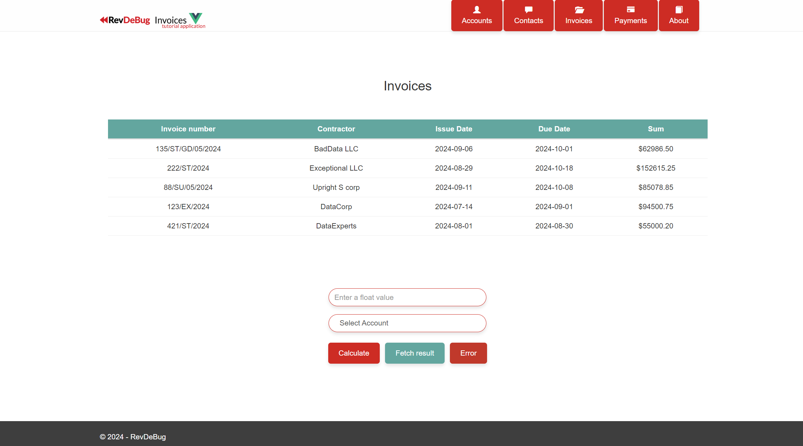
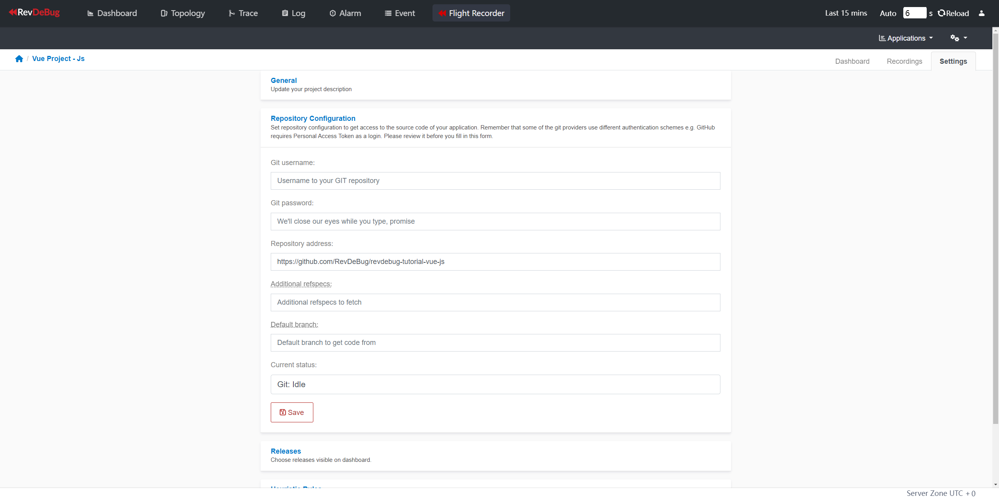
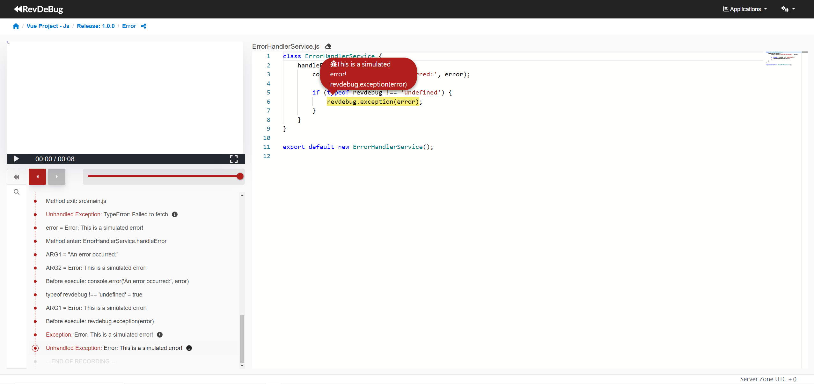

## RevDeBug Vue Js Application Example - TUTORIAL
This application is a simple invoice management system built with Vue. The following example shows RevDeBug tracking and recording code execution.

### Installation
#### Clone the project
Go to the directory where you want to clone the repository:
```sh
git clone https://github.com/RevDeBug/revdebug-tutorial-vue-js
```
#### Configure RevDeBug repository:

    npm config set @revdebug:registry https://nexus.revdebug.com/repository/npm/

Or you can just set the repository for a single project by adding an .npmrc file with the line:

    @revdebug:registry=https://nexus.revdebug.com/repository/npm/

#### Install dependancies (including RevDeBug):

    npm install 
    npm install @revdebug/revdebug

#### RevDeBug Configuration
Make sure to configure at least the **host** field and the secure field. The other options are optional.

```js
{
    "host": "revdebug.server.address",              //    The server host where RevDeBug will connect.
    "port": "42734",                             //    The port to connect to the host.
    "secure": true,                              //    Whether to use a secure HTTPS connection.
    "apm": true,                                 //    Enables Application Performance Monitoring (APM) to track app performance.
    "screen": true,                              //    Enables screen recording of application usage.
    "version": "1.0.0",                          //    The version of the current application or project.
    "solution": "Vue Project - Js",            //    The name of the solution or project.
    "application": "Revdebug tutorial Vue Js", //    The name of the specific application being monitored.
    "type": "module",                            //    Defines the project type, 'module' indicates it's part of a larger system.
    "mode": "onevent",                           //    Specifies that RevDeBug should record only on specific events.
    "sourceMap": true,                           //    Enables the use of source maps for easier debugging by mapping minified code to original.
    "path": "src",                               //    Sets the base path where the source files are located.
    "files": "**/*.js",                          //    Defines the files to be instrumented for RevDeBug (all JS files in 'src').
    "index": "public/index.html",                //    Specifies the main HTML file to be modified for RevDeBug injection.
    "excludeInst": "import",                     //    Excludes files containing 'import' statements from instrumentation.
    "target": "web",                             //    The target environment for the project (web-based).
    "entrySpan": "single",                       //    Specifies a single entry span to capture performance metrics.
    "useFMP": true,                              //    Enables capturing First Meaningful Paint (FMP) for performance analysis.
    "sw_trace_ignore_path": "/main*"             //    Ignore tracing requests matching the given path pattern.
}
```

### Instrumentation
Standard instrument:

    npx revd

Or instrument passing different host:

    npx revd --host your_record_server.com

### Run the application

    npm run serve

## Running with Docker
To run the Vue application using Docker, follow these steps:

Before running, configure revdebug.json. See [here](#revdebug-configuration) for how to do it.

Build the Docker image:
```bash
docker-compose build
```
Run the Docker container:
```bash
docker-compose up
```
Access the application: Open your browser and navigate to http://localhost:3000/.

## Application Overview
Navigate to Invoices web page.



### Interaction with fields

The application includes five interactive elements below the invoices table. 


Here's a detailed explanation of their purpose and functionality:

#### Input Field (Float Input)
- **Purpose**: The input field allows the user to enter a decimal value (float) which will be used in calculations.
- **Example Use**: A user can input any numeric value (e.g., 150.75) which represents a monetary value or any other quantity they want to process.

#### Select Dropdown (Account Selection)
- **Purpose**: The select dropdown is used to choose an account or category that corresponds to the value entered in the input field. 
- **Example Use**: The user can select a specific account (e.g., `Account 2`) to associate with the inputted value.

#### Calculate Button
- **Purpose**: When the `Calculate` button is clicked, the application takes the value from the input field and combines it with the selected option from the dropdown to perform a calculation.
- **Example Use**: Suppose the user inputs `100.5` and selects `Account 2`. Clicking `Calculate` could compute an operation based on these values, such as adding them to a total sum.
- **Note**: This button triggers a simple calculation but does not interact with any server.

#### Fetch Button
- **Purpose**: The `Fetch` button sends the result of the calculation (or any other predefined data) to an external endpoint via an HTTP request using the `fetch()` function.

#### Error Button
- **Purpose**: The `Error` button is designed to trigger an intentional error. This is useful for testing error handling in the application.

## Viewing Errors and Code in RevDeBug

### Find the errors in "Trace" tab
To view errors, navigate to the **"Trace"** tab in RevDeBug. Once you have the RevDeBug server open, go to the **"Trace"** tab where you can filter the traces to show only errors and limit the view to the application you are currently working on.


In this section, you will find the trace for the caused error, and you can access the recording of the code execution. Upon accessing the recording for the first time, you will be prompted to configure the source code repository address.

### Connect code repository

Follow the “connect to repository” option and fill the “Repository address” to github repository location of https://github.com/RevDeBug/revdebug-tutorial-vue-js and press “Save”.



### Accessing the Code Execution for the Error

After configuring the repository, close the inner window and reopen the code recording. This will present the source code associated with the error. You can navigate through the recording timeline using the arrow buttons at the top left, allowing you to explore how the code executed before, during, and after the error occurred.

